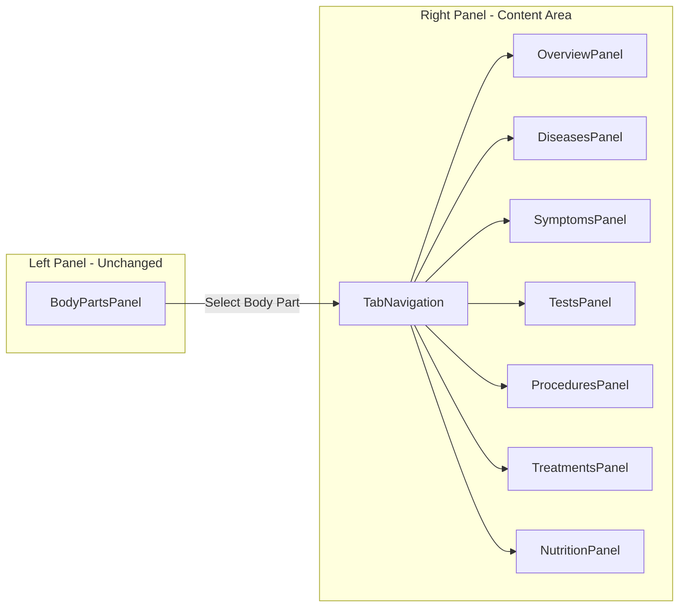

# Body Part Landing Page Template

## Architecture Overview

The template will extend the existing `MedicalExplorer` component by adding content to the currently placeholder tabs. When a user selects a body part, the Overview tab will load by default instead of Tests.



## Key Files to Create/Modify

### 1. New Data File: `src/data/bodyPartContent.ts`

Create comprehensive data structure for body part content including:

```typescript
interface BodyPartContent {
  name: string
  description: string
  image: string
  relatedSystems: string[]
  diseases: Disease[]
  symptoms: Symptom[]
  procedures: Procedure[]
  treatments: Treatment[]
  nutrition: NutritionItem[]
}
```

### 2. New Components in `src/components/MedicalExplorer/`

| Component | Purpose |

|-----------|---------|

| `OverviewPanel.tsx` | Hero section with name, description, image, mini body map, related systems |

| `DiseasesPanel.tsx` | Grid of disease cards with descriptions |

| `SymptomsPanel.tsx` | List/grid of common symptoms |

| `ProceduresPanel.tsx` | Medical procedures grid |

| `TreatmentsPanel.tsx` | Treatment options list |

| `NutritionPanel.tsx` | Beneficial foods grid |

| `BodyPartMiniMap.tsx` | Small interactive SVG showing highlighted body part |

| `ContentCard.tsx` | Reusable card component for all content types |

### 3. Modify Existing Files

- [`src/components/MedicalExplorer/index.tsx`](src/components/MedicalExplorer/index.tsx) - Default to 'overview' tab when body part selected
- [`src/components/MedicalExplorer/TestsPanel.tsx`](src/components/MedicalExplorer/TestsPanel.tsx) - Refactor to render appropriate panel based on tab
- [`src/components/MedicalExplorer/MedicalExplorer.css`](src/components/MedicalExplorer/MedicalExplorer.css) - Add styles for new panels
- [`src/types/index.ts`](src/types/index.ts) - Add new interfaces

## Overview Panel Layout

```
+--------------------------------------------------+
|  [Brain Image]        BRAIN (H1)                 |
|                       Description text about     |
|  [Mini Body Map]      the brain's functions...   |
|  (highlighting        -------------------------   |
|   brain region)       Related Systems:           |
|                       [Nervous] [Endocrine]      |
+--------------------------------------------------+
```

## Brain Sample Content

The Brain page will include:

- **Description**: Functions, importance, basic anatomy
- **10 Diseases**: Alzheimer's, Parkinson's, Stroke, Brain Tumor, Epilepsy, MS, Meningitis, Encephalitis, Traumatic Brain Injury, Aneurysm
- **10 Symptoms**: Headache, Memory Loss, Seizures, Confusion, Vision Changes, Speech Difficulties, Numbness, Dizziness, Balance Problems, Fatigue
- **Tests**: EEG, MRI of Brain, CT of Brain, etc. (from existing data)
- **Procedures**: Deep Brain Stimulation, Craniotomy, etc.
- **10 Treatments**: Medications, Surgery, Physical Therapy, Cognitive Therapy, etc.
- **20 Foods**: Blueberries, Salmon, Walnuts, Turmeric, Broccoli, etc.

## Implementation Notes

1. **State Management**: Use existing state in `MedicalExplorer` - just change default tab from 'tests' to 'overview'

2. **Routing**: No router needed - already using React state for tab switching (SPA behavior maintained)

3. **Reusability**: Template components accept body part name as prop, look up content from data file

4. **Styling**: Follow existing CSS patterns in `MedicalExplorer.css`